This is a command line python application for searching gene expression changes in a motor neuron disease model database.

The database is gene expression data generated from the FUSDelta14 model, published in Devoy et al. Brain, 2017. The full publication can be found [here](https://academic.oup.com/brain/article/140/11/2797/4372144)

The live application can be found [here](https://gene-expression-d9cbf16d3290.herokuapp.com/)

# Features

## Existing features

### Introduction and search options
The app loads and presents the user with a brief introduction to the app and explanation of its purpose. 

It then introduces the choices of method to search the database, using either gene name or Ensembl ID. This is followed by the prompt for the user to chose which search method they would like to use.

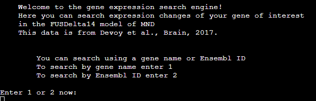

### Gene search request
The two search methods have different validation steps for user input, before providing the same output if the search is successful.

#### Validation
If the user does not input an appropriate value input validation will provide an error message and request the user try again

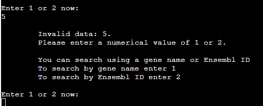

#### Gene Name
After intial selection, if valid, the user recieves a confirmation of thier choice and a prompt to enter the gene name.

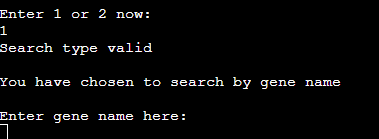

Validation of gene name:
The only validation of gene name is checking if it is in the database. This is because gene names can be a mix of letters and numbers and of variable character length. An improvement of this validation is discussed in future features.

If the name is not found in the database the following message is displayed - explaining why it may not have been be found - along with provision to search again or exit.

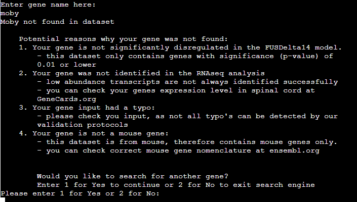

#### Ensembl ID
After intial selection, if valid, the user recieves a confirmation of thier choice and a prompt to enter the ensembl ID. This ID has a very specific format and so the criteria for the ID are set out for the user to minimise input error.

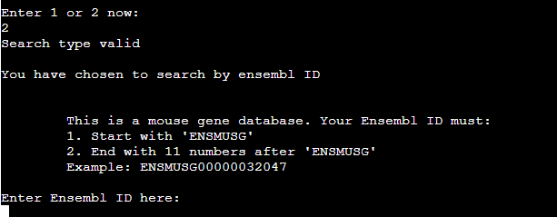

Validation of ensembl ID: As the ID has a very specific format, the validation confirms that the user input:
1. That is starts with the correct ensembl mouse gene
nomenclature of ENSMUSG
2. That it is 18 characters long
3. That the last 11 characters are numbers

If the user input is not validated the following error message is displayed and the user is prompted to input the ID again.

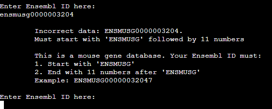

### Output
If the gene, searched via name or ID, is found in the database the user recieves a tabulated result and summary statement of the result.

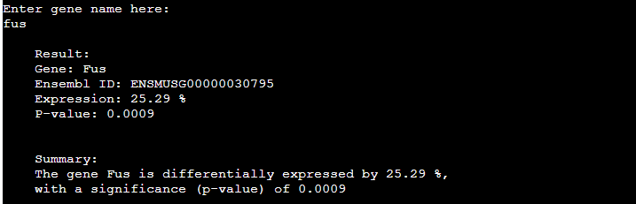

Below this, the user is also presented with an explainer, providing information on how to interpret result.

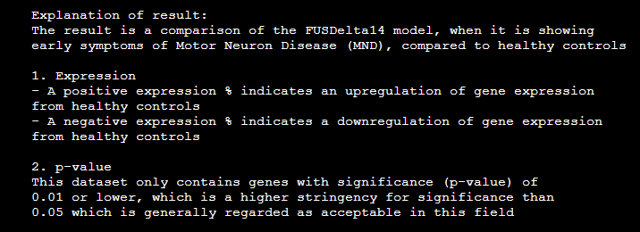

### Search another gene or exit
After a successful or unsuccessful (but valid) gene search, the user is provided with the opportunity to search for another gene or exit the app. 
If they choose to search again they receive the same menu choice at start of app:
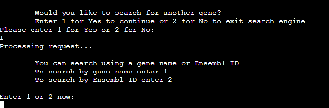

If they choose to exit, they recieve a short thank you message

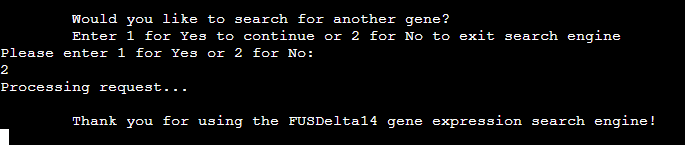

## Future features
### Multiple gene search
Allow a user to input several gene names/IDs into a single search to save time. This feature requires each entry to be seperated, validated and processed individually before all output brought togther at the end. This also allows the user to make easy comparisons between genes.

### Validation of gene name/ID against all known genes
To extend the accuracy of validating a correct gene name or ensembl ID a worksheet that contains all known mouse genes and associated ID's will be generated and included. This would allow the statement that the gene exists but is not dysregulated in this model to be made which is very useful.

### Expand number of databases to search
Include other motor neuron disease gene expression databases. This allows to user to compare genes between databases and allows user to see if expression changes are consistent across all databases (reliable result) or present in some or one database (less reliable result).

### Enable copy and paste to mock terminal
Presently the terminal does not accept a copy and pasted entry. This is problematic for the ensembl ID in particular as manual entry of this 18 character ID significantly increases the chance of user error with input. It would also be essential to have once multiple gene search is available.

# App design process

## Rationale
Searching for expression changes in genes of interest is difficult for interested readers of the original publication. The original gene expression data is only accessible from a secondary pdf document provided as supplimentary data from the publishing house website OR by downloading the raw expression data from a data repository and carrying out your own analysis. 

To resolve this issue, and make the information more accessible, a console-based app has been developed using python. This app allows the user to simply input a gene name and they will be provided with the relevant gene expression for thier query.

## Goal
 A console based app that:
 - is user friendly and intuitive
 - provides requested data quickly
 - provides the expression data in a format that is easy to understand and interpret
 - provides appropriate error feedback and explanation if users input is not matched in dataset

## Data Model
The data model used is the Genes class. 

The Genes class holds all the relevant information for each gene in the Googlesheets database : Gene name, Ensembl ID, Gene expression, Siginficance value (p-value).

The class also has method, gene_expression(), to produce a result output for a valid gene query, either via gene name or ensembl ID, to the app user.

Choosing this data model enables easy expansion of app to include new datasets in the future.

## Design of information processing flow
A flowchart of the steps in information processing that the app needed to follow was mapped out in Figma.

This flowchart was used to guide the development of functions and processes within the app. As the app was built and changes were made to the flow of the app, the flow chart was adjusted accordingly.

## Development process
The app development followed the logical flow outlined in the flowchart, with steps outlined below:
1. linked googlesheet database and created constants from data
2. Intro and search type selection
3. search type validation
4. gene name search
5. gene expression output
6. new search or exit
7. ensembl ID search and validation
8. Introduction of Gene class and function refactoring

The Gene class was added at a late stage in development as inclusion of a data model was intially missed from the app design. As all functions were already working, this refactoring required minimal change to app structure and functions.

# Technologies
- Python - all app functions
- Figma – flowchart development
- Photoshop - Readme image processing
- ChatGPT - troubleshooting, typo finding and logic problems
- Heroku - app deployment and hosting
- UI.dev – amiresponsive was used to create site mockup images.

# Testing

## General Strategy
Functions were tested as they were developed by running run.py within IDE terminal. The app was only deployed to Heroku once all gene name search and general functions were developed. The ensembl ID search functions were added after deployment, with initial function testing still carried out in IDE terminal. 

All functions, including validation steps were tested after each deployment. Testing steps were as follows:
1. search selection
    - test if correct gene name and ID selections work
    - test if incorrect input of no input (''), word (mouse), letter (p) and wrong number (5) failed validation and gave correct value error message

2. gene name search
    - test if valid gene name (fus) produced correct gene expression output
    - test if invalid gene (moby) produced the correct 'gene not found' response

3. ensembl ID search
    - test if valid ID (ENSMUSG00000032047) produced correct gene expression output
    - test if ID validation worked correctly by identifying:
        - no input ('')
        - not an ID (fus)
        - not 18 characters (ENSMUSG000000320)
        - ENSMUSG start wrong (ENSMUPG00000032047)
        - last 11 characters not numbers (ENSMUSG0000003204m)

4. search again/ exit
    - test if valid input starts search again or produces thank you messsage on exit correctly
    - test if incorrect input of no input (''), word (mouse), letter (p) and wrong number (5) failed validation and gave correct value error message

## Devices and Browsers

### Web browsers

### Devices

### Testing Summary

## Final Validation
PYTHON - PEP8 validation: The app passed validation with no errors reported from [CI pep8 python linter](https://pep8ci.herokuapp.com/)
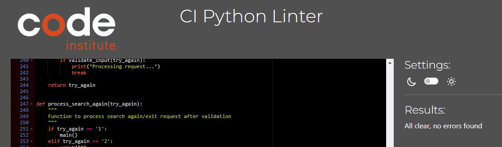

# Bugs
## Fixed
- Gene_expression function print output occurs twice if user has selected to search again on deployed app. FIX: Cause unknown. Was present in first Heroku deployment and dissapeared after update. Logic for calling the function was changed anyway, to protect from similar bug occuring in future.
- Validation of ensembl ID input not working. Does not detect change in length or incorrect format. FIX: Logic error - used ChatGPT to troubleshoot and adjust logic so that validation steps worked correctly.
- App throws type error for search_selection(search_type) after introducing Genes as class and does not run past selecting search option. FIX: required inclusion of genes as input variable: search_selection(search_type, genes) in both function and when called in main.

## Unfixed
- no input for gene name search produces 'gene not found' message, not data incorrect error.

# Deployment
For deployment this project uses a mock terminal for Heroku provided by Code Institute. The app was deployed to Heroku using the process described in the CI python module coursework.

In summary:
1. Within the IDE used (Gitpod) a requirements.txt document was populated with the list of dependencies for correct deployment by entering the command 'Pip3 freeze > requirements.txt' into the terminal.
2. Within Heroku the option for setting up a new app was selected and the following settings were set:
    - Config Vars (key - value):
        - CREDS - copy and paste content from creds.json file in IDE
        - PORT - 8000
    - Buildpacks:
        - Python
        - Node.js
3. The app was then deployed by connecting the corect GitHub repo (gene-expression) and selecting manual deployment option for the first deployment.
4. The deployment setting was changed to automatic once the majority of functions had been written and tested.

If you wish to develop this app further, feel free. To do this, create a fork of this repository and save it to your own github profile. To do this, use the fork button at the top right of this repository. This brings you to a new window, where you select yourself as the owner and can add extra details to name and description of the repo. You will then, if required, deploy to your own Heroku account using the process described above. If you chose to do this, please be respectful and credit me as the origin of this project and code.

# Credits
I would like to acknowledge and thank the following people and resources used in the creation of this site.

I would also like to note that this app was developed during a period where I was moving countries and was deprived of reliable internet connections for significant periods of time. As such normal support routes of mentor meetings and tutoring, which require stable internet, were not available and ChatGPT was used as a replacement. While no code was directly generated by ChatGPT it does write out corrections for exisiting code, in a way that mentors and tutors do not, and I would like to acknowledge this fact.

## Content
- The original gene expression data used as the dataset for this app is from [Devoy et al, Brain, 2017](https://academic.oup.com/brain/article/140/11/2797/4372144)
- [Code Institute (CI)](https://github.com/Code-Institute-Solutions) for providing all supporting code for the virtual console used for deployment of app
- [CI Love Sandwiches walkthrough project](https://github.com/Code-Institute-Solutions/love-sandwiches-p5-sourcecode):
    - linking API and Google sheets process and code
    - Deployment to Heroku
    - usage of try method - used as starting point for validate_input function
- [Medium](https://aryanirani123.medium.com/read-and-write-data-in-google-sheets-using-python-and-the-google-sheets-api-6e206a242f20) for tutorial on methods of getting specific information from Google sheets
- [W3Schools](https://www.w3schools.com/python/python_try_except.asp) tutorial on usage of try/except for validation functions
- [Digital Ocean](https://www.digitalocean.com/community/tutorials/python-valueerror-exception-handling-examples) for tutorial on ValueError handling
- [ChatGPT](https://chatgpt.com):
    - typo identification
    - troubleshooting
    - optimising logic for validation functions
    - correcting gene_data function (significant code change from original)
- [Free Code Camp](https://www.freecodecamp.org/news/python-exit-how-to-use-an-exit-function-in-python-to-stop-a-program/) for tutorial on how to use exit() function
- [geeksforgeeks.org](https://www.geeksforgeeks.org/precision-handling-python/) for rounding float to 2 decimal places tutorial
- [Python.org](https://peps.python.org/pep-0008/#indentation) for guidance on how to split and indent code when single line to long.

## Media
- The Github summary bar used in README.md is from [shields.io](https://shields.io/badges/)

## Acknowledgements
- My wife, Megan, for help with testing and general emotional support while I was trying to study and code while also moving country.
- My original science colleagues, without thier contributions I would not have produced the dataset this app is based around.
