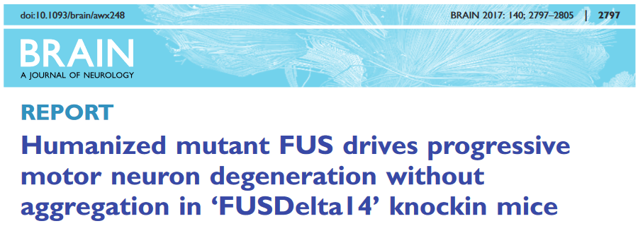
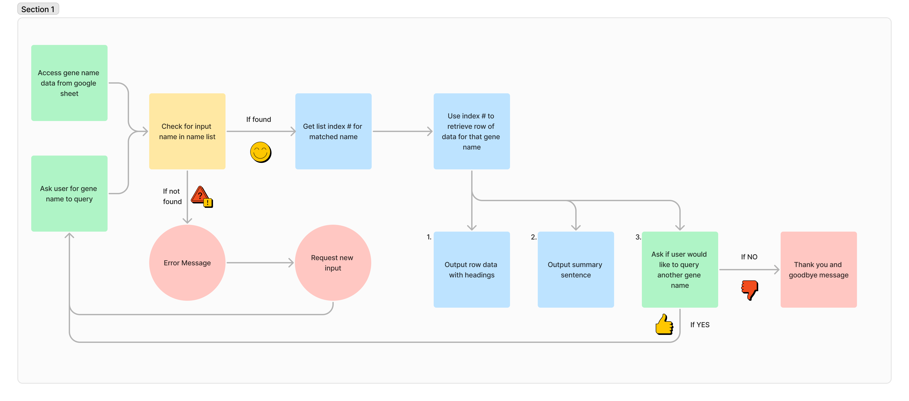

This is a command line python application for searching gene expression changes in a motor neuron disease model database.

The database is gene expression data generated from the FUSDelta14 model, published in Devoy et al. Brain, 2017. The full publication can be found [here](https://academic.oup.com/brain/article/140/11/2797/4372144)

The live application can be found [here]()

# Features

## Existing features

### Introduction and app explainer

### Request for gene to search

#### Gene Name

#### Ensembl ID

### Output

### Search another gene or exit

## Future features

### Multiple gene search
### Validation of gene name/ID against all known genes

### Compare genes

# App design process

## Rationale
Searching for expression changes in genes of interest is difficult for interested readers of the original publication. The original gene expression data is only accessible from a secondary pdf document provided as supplimentary data from the publishing house website OR by downloading the raw expression data from a data repository and carrying out your own analysis. 

To resolve this issue, and make the information more accessible, a console-based app has been developed using python. This app allows the user to simply input a gene name and they will be provided with the relevant gene expression for thier query.

## Goal
 A console based app that:
 - is user friendly and intuitive
 - provides requested data quickly
 - provides the expression data in a format that is easy to understand and interpret
 - provides appropriate error feedback and explanation if users input is not matched in dataset

## Design of information processing flow
A flowchart of the steps in information processing that the app needed to follow was generated in Figma.

This flowchart was used to guide the development of functions and processes within the app. As the app was built and changes were made to the flow of the app, the flow chart was adjusted accordingly.

## Development process

# Technologies
- Python - all app functions
- Figma – flowchart development
- Photoshop - Readme image processing
- ChatGPT - troubleshooting of typos and logic problems
- Heroku - app deployment and hosting

# Testing

## General Strategy

## Devices and Browsers

### Web browsers

### Devices

### Testing Summary

## Final Validation

# Bugs
## Fixed
- gene_expression function print output occurs twice if user has selected to search again on deployed app. Cause unknown. Was present in first Heroku deployment and dissapeared after update. Logic for calling the function was changed anyway, to protect from similar bug occuring in future.
- validation of ensembl ID input not working. Does not detect change in length or incorrect format. Logic error - used ChatGPT to troubleshoot and adjust logic so that validation steps worked correctly.

## Unfixed

# Deployment

# Credits
I would like to acknowledge and thank the following people and resources used in the creation of this site.

## Content
- [Code Institute (CI)](https://github.com/Code-Institute-Solutions) for providing all supporting code for the virtual console used for deployment of app
- [CI Love Sandwiches walkthrough project](https://github.com/Code-Institute-Solutions/love-sandwiches-p5-sourcecode):
    - linking API and Google sheets process and code
    - Deployment to Heroku
    - usage of try method - used as starting point for validate_input function
- [Medium](https://aryanirani123.medium.com/read-and-write-data-in-google-sheets-using-python-and-the-google-sheets-api-6e206a242f20) for tutorial on methods of getting specific information from Google sheets
- [W3Schools](https://www.w3schools.com/python/python_try_except.asp) tutorial on usage of try/except for validation functions
- [Digital Ocean](https://www.digitalocean.com/community/tutorials/python-valueerror-exception-handling-examples) for tutorial on ValueError handling
- [ChatGPT](https://chatgpt.com) for typo identification and optimising logic for validation functions (not writing of primary code)
- [Free Code Camp](https://www.freecodecamp.org/news/python-exit-how-to-use-an-exit-function-in-python-to-stop-a-program/) for tutorial on how to use exit() function
- [geeksforgeeks.org](https://www.geeksforgeeks.org/precision-handling-python/) for rounding float to 2 decimal places tutorial

## Media
The original gene expression data used as the dataset for this app is from [Devoy et al, Brain, 2017](https://academic.oup.com/brain/article/140/11/2797/4372144)

## Acknowledgements
- My wife, Megan, for help with testing and general emotional support while I was trying to study and code while also moving country
- My original science colleagues, without thier contributions I would not have produced the dataset this app is based around.

## Reminders

* Your code must be placed in the `run.py` file
* Your dependencies must be placed in the `requirements.txt` file
* Do not edit any of the other files or your code may not deploy properly

## Creating the Heroku app

When you create the app, you will need to add two buildpacks from the _Settings_ tab. The ordering is as follows:

1. `heroku/python`
2. `heroku/nodejs`

You must then create a _Config Var_ called `PORT`. Set this to `8000`

If you have credentials, such as in the Love Sandwiches project, you must create another _Config Var_ called `CREDS` and paste the JSON into the value field.

Connect your GitHub repository and deploy as normal.

## Constraints

The deployment terminal is set to 80 columns by 24 rows. That means that each line of text needs to be 80 characters or less otherwise it will be wrapped onto a second line.

-----
Happy coding!