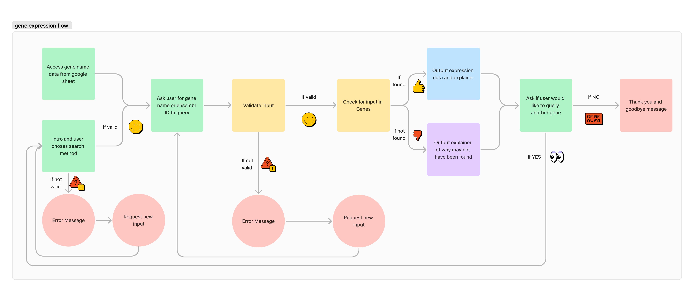

This is a command line python application for searching gene expression changes in a motor neuron disease model database.

The database is gene expression data generated from the FUSDelta14 model, published in Devoy et al. Brain, 2017. The full publication can be found [here](https://academic.oup.com/brain/article/140/11/2797/4372144)

The live application can be found [here]()

# Features

## Existing features

### Introduction and app explainer

### Request for gene to search

### Output

### Search another gene or exit

## Future features

### Search by Ensembl ID

### Compare genes

# App design process

## Rationale
Searching for expression changes in genes of interest is difficult for interested readers of the original publication. The original gene expression data is only accessible from a secondary pdf document provided as supplimentary data from the publishing house website OR by downloading the raw expression data from a data repository and carrying out your own analysis. 

To resolve this issue, and make the information more accessible, a console-based app has been developed using python. This app allows the user to simply input a gene name and they will be provided with the relevant gene expression for thier query.

## Goal
 A console based app that:
 - is user friendly and intuitive
 - provides requested data quickly
 - provides the expression data in a format that is easy to understand and interpret
 - provides appropriate error feedback and explanation if users input is not matched in dataset

## Design of information processing flow
A flowchart of the steps in information processing that the app needed to follow was generated in Figma.

This flowchart was used to guide the development of functions and processes within the app

## Development process

# Technologies
- Python - all app functions
- Figma – flowchart development
- Photoshop - Readme image processing
- Heroku - app deployment and hosting

# Testing

## General Strategy

## Devices and Browsers

### Web browsers

### Devices

### Testing Summary

## Final Validation

# Bugs
## Fixed

## Unfixed

# Deployment

# Credits
I would like to acknowledge and thank the following people and resources used in the creation of this site.

## Content
- linking API and Googlesheets process and code taken from CI Love Sandwiches walkthrough project
- [geeksforgeeks.org](https://www.geeksforgeeks.org/precision-handling-python/) for rounding float to 2 decimal places tutorial

## Media

## Acknowledgements

## Reminders

* Your code must be placed in the `run.py` file
* Your dependencies must be placed in the `requirements.txt` file
* Do not edit any of the other files or your code may not deploy properly

## Creating the Heroku app

When you create the app, you will need to add two buildpacks from the _Settings_ tab. The ordering is as follows:

1. `heroku/python`
2. `heroku/nodejs`

You must then create a _Config Var_ called `PORT`. Set this to `8000`

If you have credentials, such as in the Love Sandwiches project, you must create another _Config Var_ called `CREDS` and paste the JSON into the value field.

Connect your GitHub repository and deploy as normal.

## Constraints

The deployment terminal is set to 80 columns by 24 rows. That means that each line of text needs to be 80 characters or less otherwise it will be wrapped onto a second line.

-----
Happy coding!